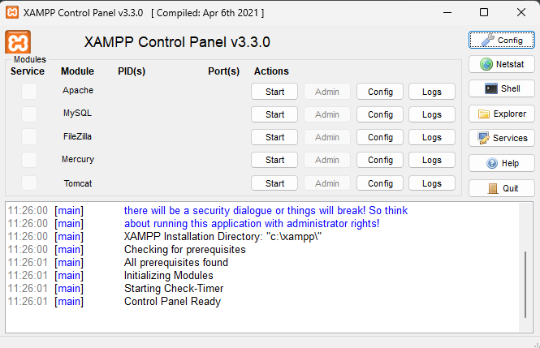
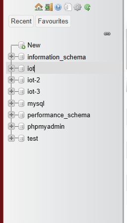
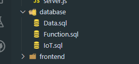

# Setup code

## Backend và Database 

+ Cài đặt các modulse , vào terminal của thư mục BE: 

~~~ 
    'npm install'
~~~

+ Cài đặt XAMPP và setup môi trường nếu có . Xong bấm start Apache và MySQL. Rồi bấm nút Admin dòng MySQL

+ Nó sẽ về trang myphpAdmin rồi mọi người tạo database tên 'IoT'

+ Bắt đầu tạo database = import các file trong database theo thú tự IoT->Function->Data

## Frontend

+ Cài đặt các modules vào terminal của FE /src/frontend/ :

~~~ 
    'npm install'
~~~

+ Run chương trình lệnh :

~~~ 
    'npx expo start'
~~~

+ Nó sẽ ra 1 QR code + 1 list các lệnh. Nếu dùng đt tải expo thì quét QR bth nó sẽ lên app trên điện thoại. Còn nếu giả lập điện thoại trên lap rôi thì không cần chỉ cần chọn option 'a' là nó sẽ tự mở app trên điện thoại
