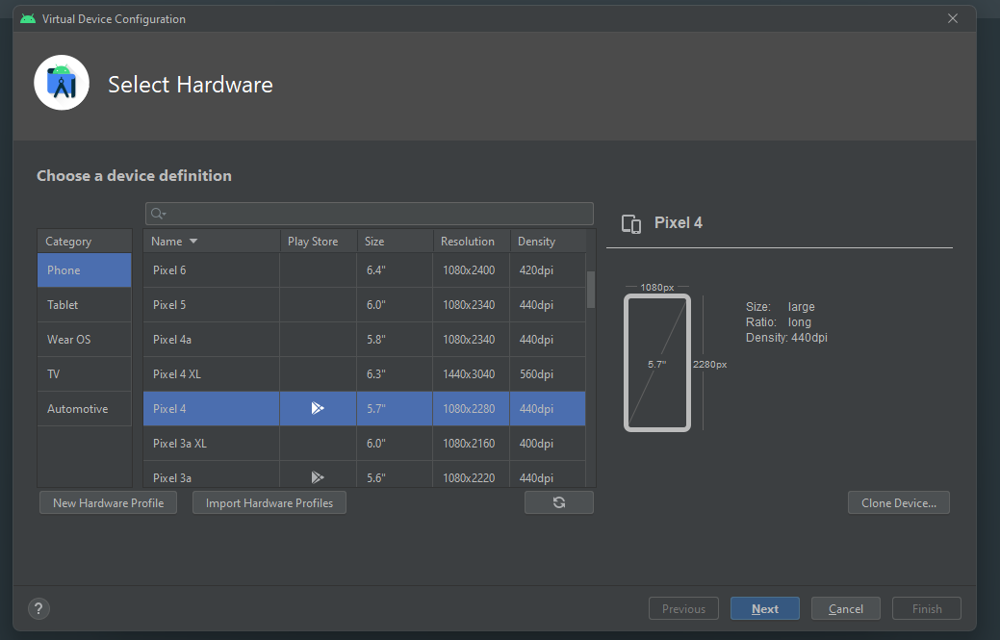

# Tải Androi Studio {#1}
Download Androi Studio tại : https://developer.android.com/studio?hl=vi , việc cài đặt này để anh em thống nhất 1 màn hình và khi báo cáo có thấy lấy máy của ai thuyết trình cũng được! ( Nếu máy cùi quá thì tải expo trên di động để xài )

+ Khởi động lên sẽ có giao diện như vậy

+ xong bấm vài dấu 3 chấm bên phải rồi chọn Virtual Device Manager

+ nó sẽ hiện ra 1 màn hình tiếp như sau rồi mình chọn cái Create Device ( cái ở dưới là đã tạo rồi)

+ Tiếp tục sẽ hiện ra giao diện và mình chọn cấu hình của điện thoại, hiện Q đang xài Pixel3a nó hơi cấn nên chắc thử đổi qua Pixel4. Xong bấm Next

+ Tiếp tục nó setting về hệ điều hành chọn cái S và bấm dấu download bên cạnh để tải về. Tải xong mới bấm Next được

+ Sau khi tải xong bấm Next

+ Bấm next tiếp, ai có nhu cầu setting thì ngồi vọc thêm

+ Và đây là xong nó sẽ hiện cái mình mới tạo

# Setup code

## Backend và Database 

+ Cài đặt các modulse , vào terminal của thư mục BE: 

~~~ 
    'npm install'
~~~

+ Cài đặt XAMPP và setup môi trường nếu có , như Quang thi không . Xong bấm start Apache và MySQL. Rồi bấm nút Admin dòng MySQL

+ Nó sẽ về trang myphpAdmin rồi mọi người tạo database tên 'iot'

+ Bắt đầu tạo database = import các file trong database theo thú tự IoT->Function->Data

## Frontend

+ Cài đặt các modules vào terminal của FE /src/frontend/ :

~~~ 
    'npm install'
~~~

+ Run chương trình lệnh :

~~~ 
    'npx expo start'
~~~

+ Nó sẽ ra 1 QR code + 1 list các lệnh. Nếu dùng đt tải expo thì quét QR bth nó sẽ lên app trên điện thoại. Còn nếu giả lập điện thoại trên lap rôi thì không cần chỉ cần chọn option 'a' là nó sẽ tự mở app trên điện thoại
